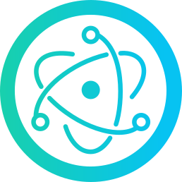
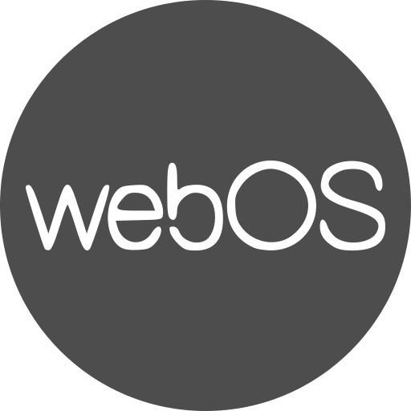

<!-- Introduction -->

  <h1>Hi there, I'm Burak ÜNAL! 👋</h1>
  
I'm a passionate software developer with a diverse skill set and a zest for creating innovative solutions across various platforms. Let's dive into what I'm all about:

<!-- Skills and Technologies -->

  <h2> Web and App Development 🚀</h2>
  
Frontend development is where I excel, and I'm well-versed in the JavaScript ecosystem. I craft modern and user-friendly websites and apps using popular libraries and frameworks like
     <b>React</b>,
     <b>Angular</b>,
     <b>Vue</b>, and
     <b>Next.js</b>. Beyond the web, I explore mobile app development with
     <b>React Native</b> and desktop application development with
     <b>Electron</b>.
  

  <h2>🎨 User Interfaces and Design 🎨</h2>
  
Creating beautiful user interfaces, prototypes, and logos is my artistic outlet. I breathe life into my designs using  <b>Figma</b> and leverage tools like
     <b>Bootstrap</b>,
     <b>Tailwind CSS</b> and
     <b>SASS</b> to craft sleek and captivating user experiences.
  

  <h2>💻 Backend and More 💡</h2>
  
I don't stop at the frontend—I'm proficient in a range of technologies, including
     <b>Python</b>,
     <b>Node.js</b>,
     <b>MongoDB</b>, and  <b>GraphQL</b>, enabling me to tackle backend development and more.
  

  <h2> Web3 and Blockchain ⛓️</h2>
  
My curiosity has led me to delve into Web3 technologies, paving the way for smart contract and DApp development. I'm excited about the potential of blockchain-based projects.

  <h2> Swift Developer and more 🍏</h2>
  
I've already made strides in learning Swift, and my proficiency continues to grow. I'm on a path to design and develop applications across a spectrum of platforms, including
         <b>iOS</b>,
         <b>Android</b>,
         <b>HarmonyOS</b>,
         <b>WebOS</b>,
         <b>macOS</b>,
         <b>Linux</b>, and  <b>Windows</b>
  

<!-- Contact Section -->

  <h3>Get in Touch 📞</h3>
  
If you're interested in my projects or want to collaborate, don't hesitate to reach out!

  <a href="https://linktr.ee/burakunal28"><strong>Personal Website</strong></a>

<!-- Projects Section -->

  <h2>My Projects 🚧</h2>
  
Here are some of the projects I've had the pleasure of working on:

  <table>
    <tr>
      <td><a href="https://burakunal28.github.io/colorful-notes">Colorful Notes</a></td>
      <td><a href="https://burakunal28.github.io/prusa-social">Prusa Social</a></td>
      <td><a href="https://www.figma.com/@burakunal">Design Projects</a></td>
    </tr>
  </table>
  
Feel free to explore them, and let's connect for more exciting opportunities! 🚀

